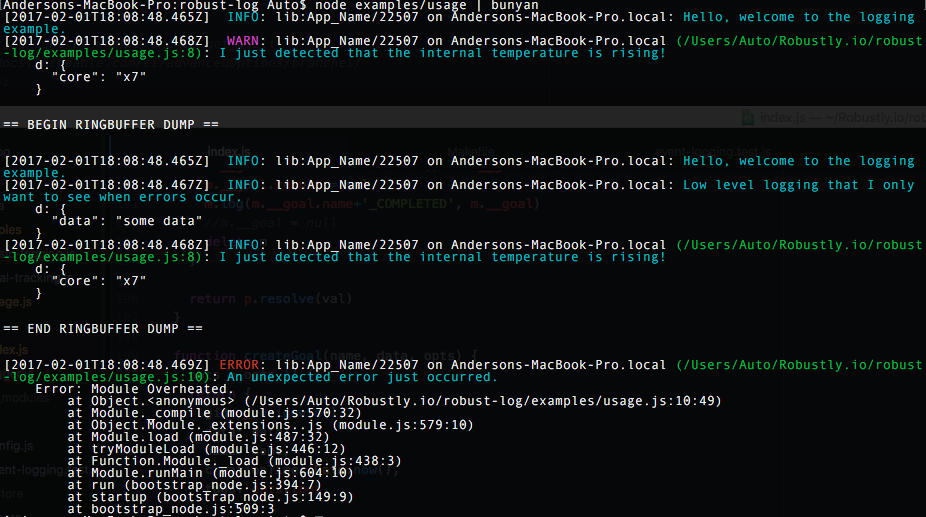

# robust-log

[](https://app.shippable.com/projects/588995b5f35d500f0014a472)
[](https://app.shippable.com/projects/588995b5f35d500f0014a472)

Robust logs is a simple and fast logging module for browser/node.js services.

``` javascript
  var log = require('robust-log')('App_Name')

  log('Hello, I am a simple log message.')
```

It uses [bunyan](https://github.com/trentm/node-bunyan)'s data format so it is compatible with
bunyan log viewer and a number of other utilities you can check out here: [bunyan-tools](https://github.com/trentm/node-bunyan/wiki/Awesome-Bunyan)

Robust-Log performs better in some cases, and has a better logging API with support for more advanced features than standard Bunyan.

## Table of Contents

<!-- toc -->

- [Current Status](#current-status)
- [Installation](#installation)
- [Features](#features)
- [Examples](#examples)
- [API](#api)
- [FAQ](#faq)

<!-- tocstop -->

## Current Status

Robust-Logs is being used in a number of production environments in node backend services.
Browser support is coming soon.

## Installation

`npm i robust-log`

*Optional Log Viewer For Development*

`npm i -g bunyan` -- command line log viewer

## Features

- Standard interface for logging management.  
- Extensible via stream plugins.
- Buffers low log levels to help keep logs small.
- Supports all javascript environments.  (Browser, Node.js)
- Tracks success rates and performance history. (via goal tracking.)
- Multiple report formats. (JSON, CSV, etc...)
- Dumps buffered trace reports when an error is logged.
- Supports large scale deployments.

## Examples

### Basic Usage

``` javascript
  var log = require('robust-log')('App_Name')

  log('Hello, welcome to the logging example.')

  log.trace('Low level logging that I only want to see when errors occur.',
    {data: 'some data'})

  log.warn('I just detected that the internal temperature is rising!', {core: 'x7'})

  log.error('An unexpected error just occurred.', new Error('Module Overheated.'))
```

*Output With Bunyan Log Viewer*

`node examples/usage.js | bunyan`



*Raw Output*

`node examples/usage.js`

```
{"name":"lib:App_Name","hostname":"Andersons-MacBook-Pro.local","pid":22581,"level":30,"msg":"Hello, welcome to the logging example.","time":"2017-02-01T18:15:07.402Z","v":0}
{"name":"lib:App_Name","hostname":"Andersons-MacBook-Pro.local","pid":22581,"level":40,"d":{"core":"x7"},"src":{"file":"/Users/Auto/Robustly.io/robust-log/examples/usage.js","line":8},"msg":"I just detected that the internal temperature is rising!","time":"2017-02-01T18:15:07.405Z","v":0}


== BEGIN RINGBUFFER DUMP ==


{"name":"lib:App_Name","hostname":"Andersons-MacBook-Pro.local","pid":22581,"level":30,"msg":"Hello, welcome to the logging example.","time":"2017-02-01T18:15:07.402Z","v":0}
{"name":"lib:App_Name","hostname":"Andersons-MacBook-Pro.local","pid":22581,"level":30,"d":{"data":"some data"},"msg":"Low level logging that I only want to see when errors occur.","time":"2017-02-01T18:15:07.404Z","v":0}
{"name":"lib:App_Name","hostname":"Andersons-MacBook-Pro.local","pid":22581,"level":30,"d":{"core":"x7"},"src":{"file":"/Users/Auto/Robustly.io/robust-log/examples/usage.js","line":8},"msg":"I just detected that the internal temperature is rising!","time":"2017-02-01T18:15:07.405Z","v":0}


== END RINGBUFFER DUMP ==


{"name":"lib:App_Name","hostname":"Andersons-MacBook-Pro.local","pid":22581,"level":50,"err":{"message":"Module Overheated.","name":"Error","stack":"Error: Module Overheated.\n    at Object.<anonymous> (/Users/Auto/Robustly.io/robust-log/examples/usage.js:10:49)\n    at Module._compile (module.js:570:32)\n    at Object.Module._extensions..js (module.js:579:10)\n    at Module.load (module.js:487:32)\n    at tryModuleLoad (module.js:446:12)\n    at Function.Module._load (module.js:438:3)\n    at Module.runMain (module.js:604:10)\n    at run (bootstrap_node.js:394:7)\n    at startup (bootstrap_node.js:149:9)\n    at bootstrap_node.js:509:3"},"src":{"file":"/Users/Auto/Robustly.io/robust-log/examples/usage.js","line":10},"msg":"An unexpected error just occurred.","time":"2017-02-01T18:15:07.406Z","v":0}
```

## API

Be aware that Robust-Log makes use of the following environment variables:

    LOG_FILTERS="Submodule_name"   # use this if you'd like to enable stdout logging for a submodule.
    NODE_APP="App_Name"  # This should match require('robust-log')('App_Name')
    NODE_ENV="test"  # The environment will always be logged along with messages.

All logging apis return a promise which would indicate that the message has been flushed
to all streams registered.  

### Logging an event

#### log(eventLabelStr, [detailsObj], [opts])

  - Log Level: INFO (30)
  - Returns: Promise

##### Example

    log('something happened', {more_details:1})

#### log.warn(eventLabelStr, [detailsObj], [opts])

  - Log Level: WARN (40)

#### log.trace(eventLabelStr, [detailsObj], [opts])

  - Log Level: INFO (10)
  - Returns: Promise
  - Trace is the lowest priority log level.
  - By default: trace events are buffered and only written to the log stream if an error occurs.

#### log.error(errorLabelStr, errObj, [opts])

  - Log Level: ERROR (50)
  - Returns: Promise
  - If an error is logged, it will also flush the ringbuffer (by default)
  - Writes to stderr as well as stdout
  - Recommended: Only use log.error when an unrecoverable error has occurred.  If an exception can
  be handled or ignored use log()

#### log.fatal(eventLabelStr, [detailsObj])

  - Log Level: ERROR (60)
  - Returns: Promise
  - Performs the same functions as error.  
  - Recommended: only use log.fatal when your application cannot recover from an error and loss of service occurs.


### Goal Tracking

Goal tracking is useful to track performance and success rates for end-to-end services
and internal workflows when debugging.  If you are new to logging goals, it is recommended
that you only goal track your public APIs.

##### Example

``` javascript
function getItem(req) {
  // create a goal instance and a goal log.
  var goal = log.goal('Get Item', {req:req})

  get(req)
    .then(()=>goal.info('getting item...'))
    .then(goal.succeed)
    // if the goal fails, both the failure and the cause will be recorded in the logs.
    .catch(goal.fail)
}

getItem({id: 1})
```


#### log.goal(goalLabelStr, contextObj, opts):log

  - logs goal started event with a unique id and start timestamp
  - Returns: new instance of log with context set to the new goal

#### goal.fail([ErrorObj]) : function<Promise>

  - logs that a goal has failed and logs the error as a reason.
  - Returns: resolved Promise

#### goal.succeed([ResolvedValue]) : function<Promise>

  - logs that a goal has succeeded

### Event Handling

Events are visible globally to an application.  Any event logged in one module is available to be listened for in another module.  

log.removeEventHandler(registrationObj)
  - removes a single event handler

log.removeEventHandler(eventLabelStr)
  - removes all event handlers for event.

#### Example

``` javascript
    var log = require('robust-log')()

    function sayHi(eventLabelStr, details) { console.log('Hello Passenger!') }
    var registrationObj = log.addEventHandler("passenger arrived.", sayHi, "taxi") // replace taxi with *

    log = require('robust-log')('taxi')
    // trigger the event handler
    log('passenger arrived.')

    // cleanup
    log.removeEventHandler(registrationObj)
```

## FAQ


## Advanced Use Cases

### Usage with DevTool

### Report on goal performance numbers with respect to application versions

## Wishlist

- a compressed minified version that only requires the used bits of lodash.
